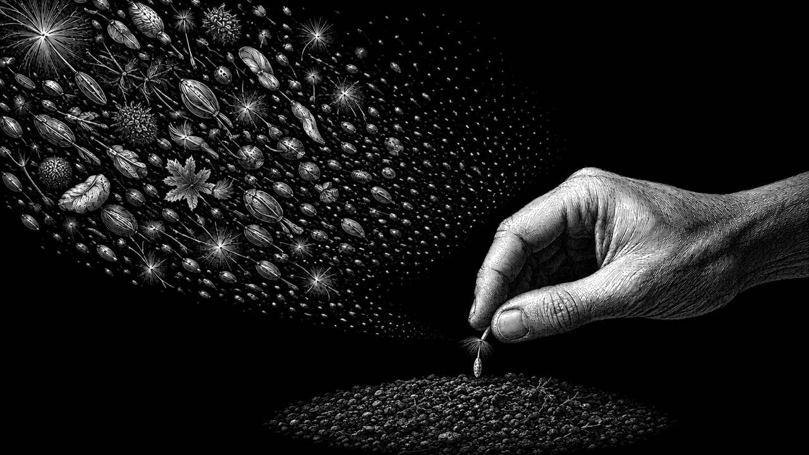

# Dan Koe Editorial Etching Skill

一个用于 Codex 和兼容 Agent Skills 环境的文章封面生成 Skill。它把文章、观点或主题转化为具有明确视觉隐喻的黑白复古蚀刻插画，视觉语言受到 Dan Koe 文章封面的启发。

> 本项目是独立、非官方的开源项目，与 Dan Koe 本人没有隶属、合作或背书关系。

## 示例与视觉参考

下方第一张是本 Skill 的实际生成结果；其余三张来自 Dan Koe 官方公开文章，仅作为视觉语言参考，版权归原作者所有。点击官方封面可阅读原文。

<table>
  <tr>
    <td width="50%" align="center">
      
      <br><strong>本 Skill 生成示例</strong><br>
      从大量知识中选择值得培育的一颗种子
    </td>
    <td width="50%" align="center">
      <a href="https://thedankoe.com/letters/ideas-are-the-new-oil-how-more-people-get-rich-in-the-digital-era/">
        
      </a>
      <br><strong>Dan Koe 官方视觉参考</strong><br>
      <a href="https://thedankoe.com/letters/ideas-are-the-new-oil-how-more-people-get-rich-in-the-digital-era/">Ideas Are The New Oil</a>
    </td>
  </tr>
  <tr>
    <td width="50%" align="center">
      <a href="https://thedankoe.com/letters/how-average-people-will-get-rich-with-ai/">
        
      </a>
      <br><strong>Dan Koe 官方视觉参考</strong><br>
      <a href="https://thedankoe.com/letters/how-average-people-will-get-rich-with-ai/">How Average People Will Get Rich With AI</a>
    </td>
    <td width="50%" align="center">
      <a href="https://thedankoe.com/letters/how-to-think-originally/">
        
      </a>
      <br><strong>Dan Koe 官方视觉参考</strong><br>
      <a href="https://thedankoe.com/letters/how-to-think-originally/">How To Think Originally</a>
    </td>
  </tr>
</table>

生成示例的输入：

> 当获取知识变得容易，判断什么值得学习反而更加重要。

画面将观点转化为“从漫天种子中选择一颗，种进有限土壤”的视觉隐喻。

## 能做什么

- 根据完整文章、标题、主题或一段观点生成文章封面。
- 自动提炼核心主张，并把抽象内容转化为场景或视觉隐喻。
- 保持黑白、高对比、排线与交叉排线构成的复古蚀刻质感。
- 支持横向、纵向和方形比例，默认生成无文字图片。
- 在可用时调用环境内置的图像生成工具完成实际出图。

## 安装

### 让 Codex 安装

把下面这句话发送给 Codex：

```text
请从 https://github.com/Richology/dankoe-editorial-etching-skill 安装 Skill，Skill 位于 dankoe-editorial-etching 目录。
```

### 手动安装

```bash
git clone https://github.com/Richology/dankoe-editorial-etching-skill.git
mkdir -p ~/.codex/skills
cp -R dankoe-editorial-etching-skill/dankoe-editorial-etching ~/.codex/skills/
```

安装后开启一个新任务，让 Codex 重新发现该 Skill。

## 使用

直接调用：

```text
使用 $dankoe-editorial-etching 配图。

核心意思：当获取知识变得容易，判断什么值得学习反而更加重要。
比例：3:4
视觉方向：自由发挥
```

也可以直接提供文章：

```text
使用 $dankoe-editorial-etching，为下面这篇文章生成一张 16:9 的无字封面：

粘贴文章内容……
```

## 输入建议

只提供自然语言内容即可。需要更准确地控制结果时，可以补充：

```text
标题：
主题：
比例：1:1 / 4:5 / 3:4 / 16:9 / 9:16 / 5:2
核心意思：
视觉方向：自由发挥，或指定主体、场景、意象、氛围与构图
```

## 环境要求

Skill 本身提供工作方法和视觉约束。实际生成图片时，运行环境还需要具备可用的图像生成工具，例如 Codex 内置的图像生成能力。

## 目录结构

```text
dankoe-editorial-etching/
├── SKILL.md
└── agents/
    └── openai.yaml
```

## License

[MIT](LICENSE)
